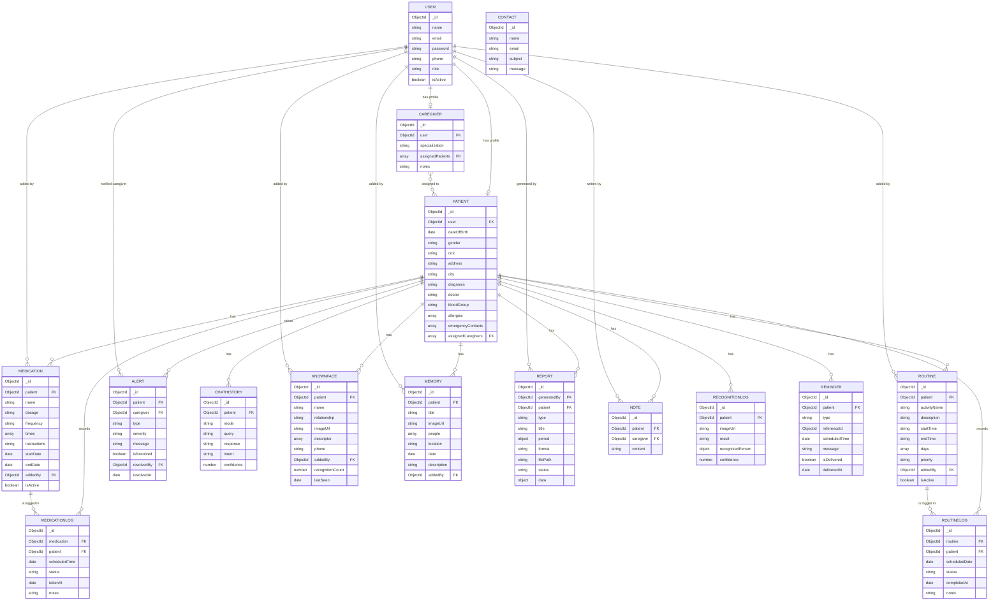

# Entity-Relationship Diagram (ERD)

Generated from the actual Mongoose models in `server/models`. It shows the 15
collections of the Memory Assistant System and their relationships.

**How to use:** paste the code block below into <https://mermaid.live>, then
export as PNG/SVG and insert into the thesis (or redraw in draw.io if strict UML
notation is required).

## Description

- **USER** is the base account for all roles. A **PATIENT** or **CAREGIVER**
  record extends a user with role-specific data (one-to-one with USER).
- **CAREGIVER** and **PATIENT** have a **many-to-many** relationship: a caregiver
  can be assigned several patients, and a patient can have several caregivers
  (stored as `assignedPatients` / `assignedCaregivers`).
- A **PATIENT** owns most operational data: medications, routines, their logs,
  alerts, chat history, known faces, memories, reports, notes, recognition logs,
  and reminders.
- **MEDICATION → MEDICATIONLOG** and **ROUTINE → ROUTINELOG** record each
  scheduled item's taken/missed/completed status over time.
- **USER** also appears as `addedBy` / `generatedBy` / `caregiver` on several
  records to track who created or is responsible for them.
- **CONTACT** is a standalone entity for public contact-form messages.

> Note: MongoDB is schema-flexible; the FK markers denote Mongoose `ObjectId`
> references (`ref`) rather than enforced relational foreign keys.
