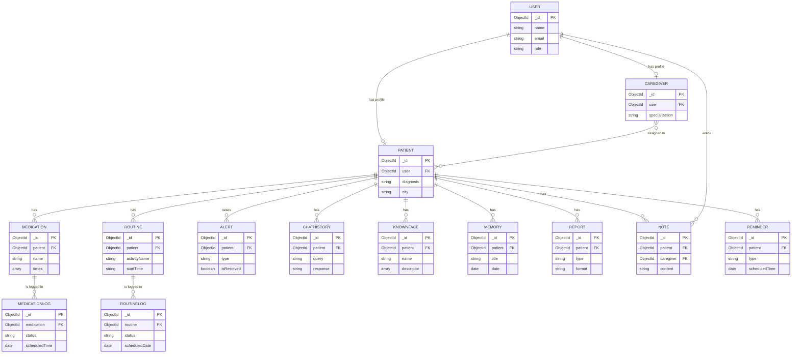

# Entity-Relationship Diagram (ERD)

Concise ERD generated from the Mongoose models in `server/models`, sized to fit
on a single A4 page. Only key attributes are shown per entity to keep it
readable when printed.

## How to render (sharp, print-ready)

1. Open <https://mermaid.live>.
2. Delete the sample code, then **copy the whole block below** (everything
   between the ` ```mermaid ` fences) and paste it into the left editor.
3. It renders live on the right. If nothing shows, you copied a stray backtick —
   re-copy just the code.
4. **Export as SVG** (Actions ▸ *SVG*). SVG is vector — it stays sharp at any
   size and will **not blur when printed**. (Avoid PNG for print.)
5. Insert the SVG into Word (Insert ▸ Pictures). Scale it to the page width.

> You don't need a notebook — the code is already saved here in the repo. Just
> copy this block into mermaid.live.



## Description

- **USER** is the base account; **PATIENT** and **CAREGIVER** extend it
  one-to-one with role-specific data.
- **CAREGIVER**–**PATIENT** is many-to-many (a caregiver has many patients; a
  patient can have several caregivers).
- A **PATIENT** owns their medications, routines, alerts, chat history, known
  faces, memories, reports, notes, and reminders.
- **MEDICATION → MEDICATIONLOG** and **ROUTINE → ROUTINELOG** track each
  scheduled item's taken/missed/completed status.
- FK marks a Mongoose `ObjectId` reference (`ref`); MongoDB does not enforce
  relational foreign keys.

> Two minor collections are omitted for clarity: **RecognitionLog** (face-scan
> history, references Patient) and **Contact** (standalone public contact-form
> messages). Add them if your supervisor wants every collection shown.

## Notation note

This uses Mermaid's **crow's-foot** notation. If your department's reference book
requires a specific notation (e.g. **Chen** notation with diamonds/ovals), share
it and I'll adjust the entity/attribute/relationship style to match, or provide a
version you can redraw in draw.io.
